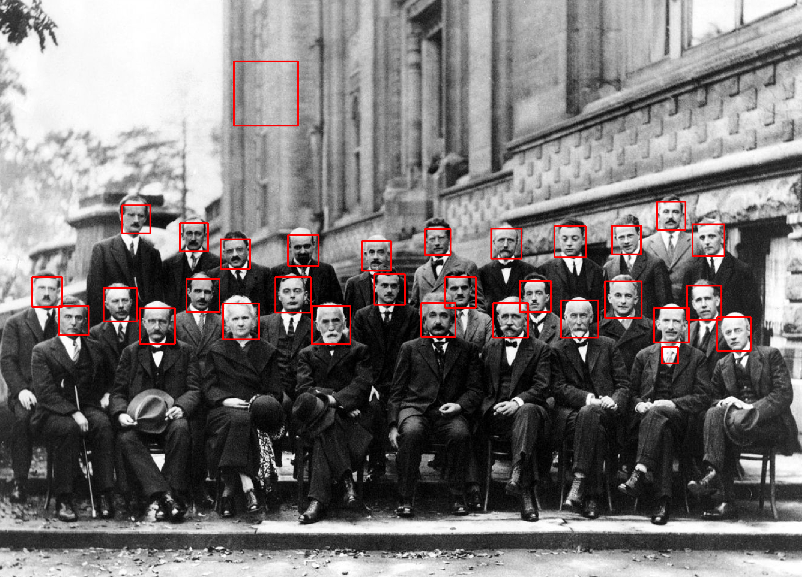
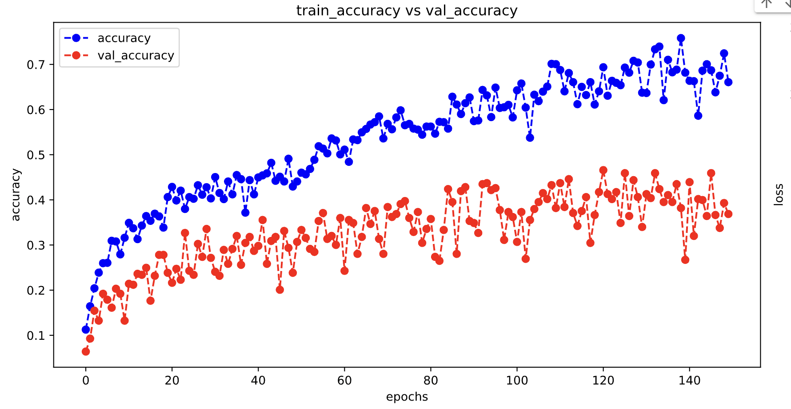
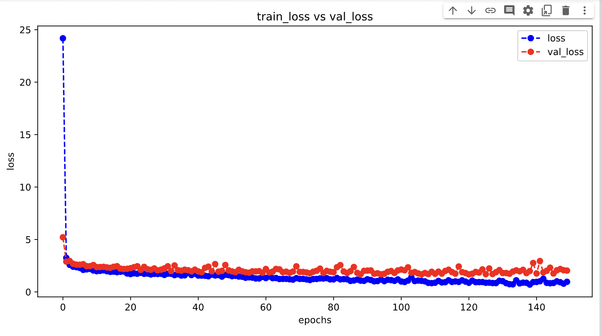

## Face Detection
Realize the classic computer vision task: face detection and recognition using Bollywood celebrity faces.

### Source Data
We pick a part of (more than 1000 observations) the [Bollywood celebrity faces](https://www.kaggle.com/datasets/havingfun/100-bollywood-celebrity-faces)  from Kaggle for face recognition purposes. The raw data contains images of different sizes for 13 different Bollywood celebrities. 

### Models
Faces will be explored using Haar-like Classifiers in OpenCV. Features will be extracted using MTCNN. Classification tasks are finished using self-built CNNs and pre-trained models in Keras such as AlexNet and ResNet. Eventually FaceNet will be used to obtain embeddings and celebrities are classified using a simple SVM or MLP. We use the renowned pre-trained FaceNet keras model (in h5 format) which is available online.

### Scripts
- `MTCNN.ipynb`: Using MTCNN to detect the location and information of the faces.
- `CNN.ipynb`: Basic exploratory data analysis and self-built CNN models.
- `EDA-FaceNet.ipynb`: Part of exploratory image visualization and SVM classification using FaceNet embeddings.
- `keras_models.ipynb`: Face detection using well-known pre-trained image recognition models in Keras.
- `FaceNet.ipynb`: FaceNet employment and performance measure.

#### Haar-like Classifiers

#### MTCNN Structure

#### FaceNet Structure

### Results
#### Train-test Proportions

#### Samples of the Correctly Labeled Images

#### Samples of the Incorrectly Labeled Images

#### Accuracy/Loss of a Self-built CNN

#### Accuracy of a Keras Built-in Model

#### Loss of a Keras Built-in Model

#### Confusion Matrix of FaceNet + SVM on Test Dataset

